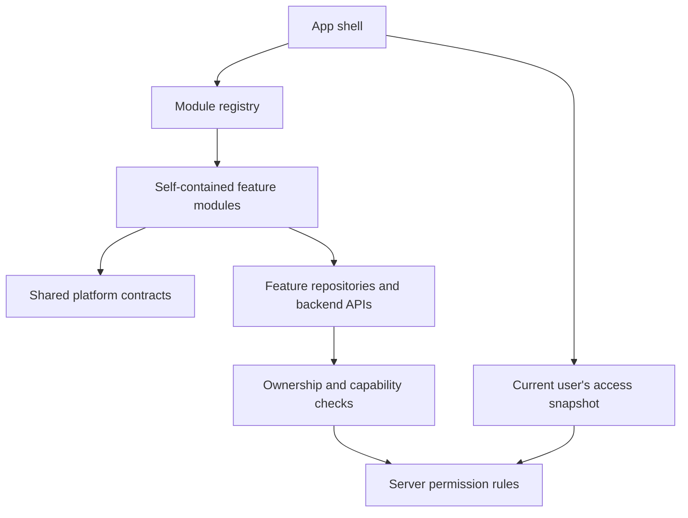

# PetLoop: independent features and user/group access

Proposal dated 5 October 2026. Requested scope: architecture and migration plan first; access controlled for individual users and groups. No refactor or live migration is included in this pass. Baseline findings and the current app map are in [code_review_2026-10-05.md](code_review_2026-10-05.md).

Implementation follow-up: the user subsequently authorized refactoring. See
[feature_access_operations.md](feature_access_operations.md) for the implemented
boundaries, controls, build composition and live activation steps. The package
tree below remains the longer-term extraction target; the first implementation
uses feature registrations and neutral service interfaces within the app.

## Proposed shape

Make each product section a self-contained feature module with its own public contract, implementation, state, UI, translations, migrations and tests. Compose those modules in the app shell. Keep shared identity, pet identity, permissions, scheduling infrastructure and design primitives in a small platform layer.

Use local Flutter/Dart packages to enforce dependency boundaries, with one Flutter application and the current Supabase backend initially. This permits independent development, replacement and removal without introducing deployment infrastructure for every screen. New client code still needs an app release; remote policy changes can enable/disable already shipped code without one. Separately deployed backend services can be extracted later behind the same interfaces when a module requires independent scaling or deployment.

Three controls serve different purposes:

| Control | Effect |
|---|---|
| Included in the build | Registers a module and its dependencies; omission physically excludes its implementation from the composition |
| Globally enabled | Makes an included module available, with a server-enforced kill switch |
| Allowed for this user | Permits capabilities according to group grants and individual overrides |

Turning a feature off preserves its data. Uninstalling backend tables or deleting existing user data is a separate migration decision. An old installed app must still be denied by the server after access is revoked.



## Module boundaries

| Module/service | Owns | Optional integrations |
|---|---|---|
| Pet profiles | Profile CRUD, photos, archive/restore | Health profile sections; First Days entry |
| Daily care | Feeding settings, meals, walks/activity | Shared schedule/logging service; basket consumption estimates |
| Health records | Records, documents, observations, reports | Budget cost summaries; reminders |
| Health schedule | Medicines and health routines | Shared schedule/logging service; emergency summaries |
| Emergency tools | Emergency profile, kit, contacts, lost-pet card | Medicines/documents summaries; public vet search |
| Community feed | Posts, comments, likes, reports | Pet summary, emergency navigation |
| Community chat | Channels, realtime messages | Shared identity |
| Guides | Bundled or remote editorial content | Contextual navigation to care/health |
| Deals | Catalogue, favourites, sharing/reports | Basket category links |
| Budget | Expense ledger and summaries | Health-cost adapter; basket purchase operation |
| Basket | Recurring products, restock estimates | Care consumption estimates; available deals; Budget ledger |
| First Days | Arrival path and task progress | Facts/actions supplied by enabled modules |
| Vet search | Regions, search, geocoding, directory cache | Emergency entry points |
| Vet directory administration | Reviewer queues and actions | Vet directory backend; explicit administration capability |

Home is a host for registered cards. Settings is a host for registered settings sections. Community and Health can retain their current tab groupings while their subsections have separate capability IDs. Start extraction with the existing feature-folder boundaries; split large modules into these subservices gradually.

Identity and minimal pet identity remain foundational services in this pet-centric application. Their implementations can be replaced behind contracts. Disabling the full pet-management UI must not remove pet identity needed by other sections. If a future distribution has no pet-dependent modules, the shell must omit the first-pet gate too; Community and public vet search do not intrinsically require a selected pet.

## Package structure and allowed dependencies

```text
app/                         Composition, shell, feature registration
packages/
  petloop_core/              Session, pet identity/context, clock, IDs,
                             locale primitives, operation errors
  petloop_design/            Theme and shared presentation primitives
  petloop_access/            Access contract, snapshots and client guards
  petloop_module_api/        Contributions, navigation intents, lifecycle
  petloop_identity/          Authentication implementation and UI
  petloop_schedule/          Shared scheduling/logging contracts and engine
  feature_pets/
  feature_health/
  feature_care/
  feature_community/
  feature_store/
  feature_budget/
  feature_firstdays/
  feature_findvet/
  petloop_integrations/      Optional adapters between module contracts
```

This is a target directory layout, not an instruction to move every file in one change. Feature packages depend on core, design and contracts. Core must not import features. A feature must not import another feature's private controllers, screens or database adapter. Optional integrations are wired by the composition layer and depend on public contracts. Contract packages must be small enough that importing one does not transitively pull in a feature implementation.

Each package exports a narrow `lib/<module>.dart` facade and keeps internals under `lib/src/`. Add an import/dependency check in CI because `src` is a convention rather than an absolute Dart access barrier. Dart supports [local path package dependencies](https://dart.dev/tools/pub/dependencies#path-packages); using a package workspace/shared lockfile is an implementation choice to verify against the installed toolchain during extraction.

## Common module contract

The API below is illustrative; these types are proposed, not implemented:

```dart
abstract interface class PetLoopModule {
  String get id;                  // Stable: "health", "store", etc.
  ModuleRequirements get requirements;
  List<RouteContribution> get routes;
  List<NavigationContribution> get navigation;
  List<HomeContribution> get homeCards;
  List<SettingsContribution> get settingsSections;
  List<PetProfileContribution> get profileSections;
  List<LocalizationsDelegate<dynamic>> get localizationDelegates;
  List<BackgroundContribution> get backgroundTasks;
  List<NotificationTargetContribution> get notificationTargets;
  List<DeletionContribution> get deletionHandlers;
}
```

Every contribution carries the module/capability ID it needs and a stable contribution ID. Modules receive platform services through interfaces/providers; UI construction must not start background tasks implicitly. Register providers and construct runtime instances in the composition layer, with an account/module lifetime and explicit start/stop behavior.

Examples of cross-feature contracts:

- `Clock` and a reactive day/time source replace imports of `healthClockProvider` outside Health.
- `PetContext` provides minimal pet data and selected-pet identity without importing Pets screens.
- `CostSource` gives Budget permitted health-cost summaries; no Budget import of Health controllers.
- `ConsumptionSource` lets Basket estimate run-out dates when Care is enabled; manual durations work without Care.
- `DealsLookup` and a navigation intent let Basket link to Deals only when Deals access is available.
- `FirstDaysFactsSource` and `ActionCatalog` provide facts and actions only from available modules. Missing integrations leave manual tasks usable; hidden features must not create inaccessible “complete your profile” requirements.
- Generic `ReminderSpec`, `NotificationSink` and target registration let each module supply its reminders. Platform scheduling code has no feature-model imports.
- Feature-owned pet profile contributions replace the Pets-to-Health cycle.

Keep shared contracts concrete and limited; do not replace typed APIs with an untyped global event bus. Navigation intents have typed parameters and required capabilities, such as an intent to open a health record for a pet.

## Shared schedule/log ownership must be resolved early

Feeding, walks and medicine currently share `care_plan_items`, `care_logs`, models and controllers under Health. Simply disabling Health tables or requiring `health.view` on those whole tables would also break Daily care and Basket.

Extract a neutral schedule/logging service. Classify rows by owning domain/capability: feeding/activity belongs to Daily care; medicine and health routines belong to Health schedule. Authorize row reads and mutations according to domain as well as pet ownership. Where `kind` or `plan_item_id` is nullable, backfill/validate domain consistently before applying the policy. Clients must not reclassify protected medical rows into an allowed daily-care domain; enforce immutable ownership/classification or verify both old and new access.

Existing data and IDs can stay in their current tables during the initial extraction. Additive migrations introduce domain classification and generic pet-ownership helpers; leave the original applied migrations intact. Later table separation is possible if it improves the boundaries.

## User and group permissions

Use server-owned permission data. Groups describe access cohorts such as “standard owners”, “beta testers” and “directory reviewers”; they do not grant access to other people's pets. Sharing pet data would require a separate ownership/sharing model.

Proposed records:

| Record | Purpose |
|---|---|
| `feature_catalog` | Stable feature ID, enabled state, documented capabilities, compatibility metadata |
| `access_groups` | Group ID and administrator-visible name |
| `access_group_members` | User membership; unique `(group_id, user_id)` |
| `group_capability_rules` | Allow/deny per `(group_id, capability)` |
| `user_capability_rules` | Individual allow/deny override per `(user_id, capability)` |
| `access_admins` | Explicit administrators for permissions; distinct from vet reviewers |
| `access_audit` | Actor, affected group/user, old/new values, time and reason |
| `access_revision` | Version used for client snapshot refresh/cache invalidation |

Capabilities can begin as `health.records.view`, `health.records.edit`, `health.records.export`, `community.feed.view`, `community.feed.post`, `community.chat.view`, `community.chat.send`, `store.deals.view`, `store.deals.share`, `budget.view`, `budget.edit`, `firstdays.view`, `firstdays.edit`, `findvet.search`, and `findvet.admin`. Expand edit into create/update/delete where product policy needs it. Writes require the corresponding view capability too. Directory-reviewer status alone never grants permission-management rights.

Proposed deterministic precedence:

1. Missing implementation, disabled feature, or unmet mandatory platform requirements: unavailable regardless of grants.
2. For an enabled feature, an explicit individual rule overrides all group rules for that capability.
3. Without an individual rule, any group deny overrides group allows; otherwise any group allow grants the capability.
4. With no matching rule: deny.
5. Required related capabilities and ordinary resource ownership checks must also pass.

Example: “beta testers” can view and edit Budget; user Dana has an individual deny on `budget.edit`, so Dana gets a read-only Budget. An individual allow can intentionally override a group deny, but cannot override the global disable switch. Permission previews must explain the rule that produced the result.

Derive menu/card visibility from view permissions by default. A deliberate locked feature teaser may be shown using separate presentation metadata; it must not fetch protected content. Keep controls for visibility and actual data access conceptually separate.

Do not trust user-editable profile fields or `user_metadata` as permissions. Fetch the user's effective snapshot through a protected `get_my_access()` RPC with no arbitrary-user parameter. Administrative evaluation of another user requires an admin-only RPC. Supabase's [RLS guidance](https://supabase.com/docs/guides/database/postgres/row-level-security) explains the distinction between editable user metadata and trusted authorization data. Prefer current database rules for revocation; JWT-based rules can lag until token refresh.

## Enforcement in every layer

### Application presentation and navigation

- Build bottom navigation, drawer entries, Home/profile cards, settings sections and localization delegates from registered contributions.
- Identify destinations by stable module/route IDs. Visible tab position must map to the correct registered shell branch; hiding Community cannot turn a Store tap into the Community branch.
- Keep the registered branch set stable for a given build/session while filtering visible entries and guarding destinations. Do not rebuild `GoRouter` on every permission snapshot update and lose navigation/form state.
- Guard router URLs, navigation intents and imperative `MaterialPageRoute` pushes. The current raw pushes need migration; a router redirect alone cannot protect them.
- Guard mounted pages too: on revocation close protected dialogs/pages, stop rendering protected data, and navigate to the nearest allowed destination. Home can provide a useful empty state with zero optional modules.
- Each notification target declares required access. Disabled/revoked/unknown targets return to an allowed destination without instantiating the hidden feature.

### State and background work

- Account-owned runtime state uses a user/session generation and is disposed or cleared on sign-out/change. Old async operations cannot populate a new account's state.
- Start feature workers only when their capabilities are allowed. On revocation stop polling/realtime subscriptions, cancel that module's pending notifications, invalidate its state, and clear account-owned caches.
- Recheck access before mutations and exports. Display a denied or read-only state rather than silently falling back to fake data.
- Refresh access after sign-in, on resume, on policy revision notifications and within a bounded TTL. Unknown initial access fails closed for protected modules. Backend enforcement is authoritative even if the client snapshot is briefly stale.
- Explicitly document offline behavior. Already downloaded data and issued signed URLs cannot be retroactively erased everywhere by a database policy; clear local caches on observed revocation and keep signed-link lifetimes limited. Do not promise instantaneous revocation of previously delivered content.
- Pet deletion and account cleanup operate through a durable server cleanup mechanism, including data/files of disabled features. Disabling UI must never disable required cleanup.

### Database, storage and Edge Functions

Keep existing ownership policies. Add feature checks so allowed access is **ownership/membership AND capability**, not either condition. PostgreSQL combines ordinary permissive policies with OR; adding a separate permissive feature policy would accidentally broaden access. Use restrictive policies or amend each relevant existing policy. The project already uses a restrictive ownership guard for `health_events`. See [PostgreSQL row-security composition](https://www.postgresql.org/docs/current/ddl-rowsecurity.html).

Use a narrowly scoped server function such as `can_use(capability)` bound to `auth.uid()`. Protect permission tables from user writes; prevent recursive RLS evaluation; fix function search paths and restrict execute grants. If an evaluator must read private policy tables with definer privileges, put the privileged implementation in an unexposed schema with a narrow checked public wrapper, following the vet-directory hardening approach.

Apply checks to tables, storage object operations and issuance of signed URLs, views, RPCs and subscriptions. Audit invoker/definer behavior rather than assuming table RLS protects every wrapper. Edge Functions using service-role access bypass ordinary caller RLS and must verify the caller and capability before privileged work. Scheduled maintenance uses a separate service/job identity and scoped authorization.

Preserve the current deliberate public emergency vet search as an explicit public capability policy. Its Edge Function has JWT verification disabled, and public directory fallback data is readable anonymously. If product policy later restricts search to selected users/groups, authenticated capability checks must be added to **both** the function and its public directory/view/RPC fallback. A client-only deny would otherwise leave search data available. The weekly directory maintenance job remains separately authorized by its job secret.

## Administrator workflow

Provide a protected permissions page (or a small internal app) to manage group membership, group rules and individual overrides. It should show effective access and its explanation for a selected user, with an audit trail. Mutations run through validated admin RPCs; the browser/mobile client never gets a service-role key. Use authenticated user IDs as keys; allow email/name lookup only in the authorized admin interface.

Rollout examples:

- Enable First Days for the “beta testers” group and one explicitly selected user.
- Give a support user read-only access to Budget functionality for their own account.
- Disable Community chat globally while leaving feed/guides available.
- Revoke one reviewer’s vet administration while leaving their public vet search unchanged.

## Migration sequence and acceptance criteria

| Stage | Work | Finished when |
|---|---|---|
| 0. Baseline and reliability | Preserve analyzer/tests; fix session races, checklist ordering, purchase atomicity and durable cleanup; add PR quality checks | Delayed/reordered operations and account changes have meaningful regression coverage |
| 1. Platform contracts | Extract session/pet context, clock, access API, module API and shared schedule/log ownership | Core has no feature imports; existing behavior remains intact |
| 2. Server permission model | Add access tables/evaluator/admin RPCs and restrictive policies; explicitly retain public vet behavior | Direct denied API calls fail for separate users/groups; ownership remains enforced |
| 3. Client composition | Registry-driven shell/cards/settings/delegates; guarded intents and mounted pages; worker lifecycle | Hiding/revoking a feature removes every entry point and stops its workers |
| 4. First complete extraction | Extract Deals/catalogue; move the Basket integration into a registered optional adapter | App works with Deals omitted while Budget/Basket remain usable; original tab behavior works with it included |
| 5. Remaining extraction | Vet search/admin, Community subservices, Budget/Basket, First Days, Care, Health and Pets contributions | Each optional module can be disabled or omitted without imports/runtime failures elsewhere |
| 6. Admin controls and rollout | Permission UI, audit, previews, revision refresh, staged groups | Owner can make and verify group/user changes without releasing the app |

Server rules precede client rollout. Seed a baseline group reproducing current authorized behavior and existing administrative grants before enforcing new denials. This avoids unintentionally locking all existing users out. Use additive migrations and small, independently reviewable changes; do not edit already applied migration files. Migration application/deployment remains a later owner-approved integration step under the repository instructions.

Suggested first extraction is Deals because its repositories are already isolated; first detach the Store-to-Basket and Basket-to-Store integration. Vet search is another good candidate, but its public access and existing reviewer RPCs make access policy more specialized. Health/Care should follow shared scheduling extraction, since their current data boundaries overlap.

Required acceptance scenarios:

1. All features enabled preserves current English/Hebrew screens and navigation/back behavior.
2. Each optional module omitted from the composition still builds; its translations and dependencies are not referenced by core.
3. Each feature disabled globally or denied to a user removes tabs/cards/links/actions and blocks direct routes, raw-page intents and API requests.
4. Budget works without Deals and Health costs; Basket works with manual consumption without Care; First Days works without automatic integrations.
5. Conflicting group rules, user overrides and global disable follow the documented precedence.
6. Permission revocation while a screen/dialog/export/chat is active prevents subsequent protected operations and stops background work.
7. Notification taps for revoked features and delayed writes after account changes cannot reopen or repopulate protected state.
8. Users cannot grant themselves capabilities or join groups; permissions do not grant other users' pet data.
9. Public vet search continues anonymously only when that explicit policy is enabled; reviewer and permission-admin operations remain separate.
10. Pet deletion cleans disabled modules' files through a durable retry mechanism.

The immediate architectural milestone is a feature registry plus server-backed user/group permissions, validated through one fully optional module. Package extraction then makes the independence enforceable across the rest of the codebase.
